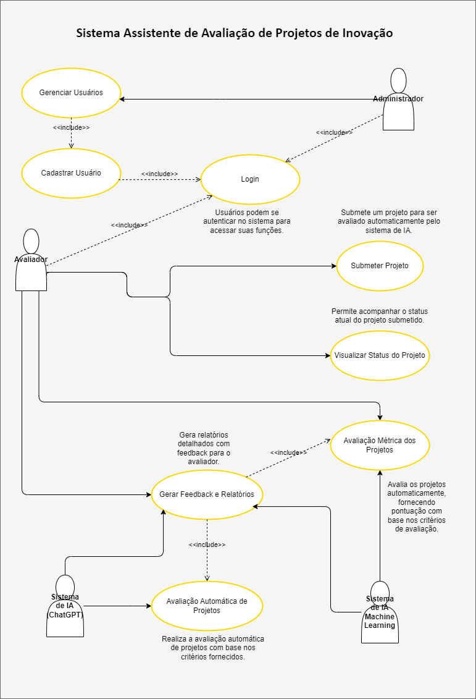

  

# Chat Softex

 
   
   
   
   
   
   
   
   
   
   
   
   
   
   
   
   
   
   

> Status do Projeto: :heavy_check_mark: (concluido) | :warning: (em desenvolvimento) | :x: (não iniciada)

### Tópicos 

:small_blue_diamond: [Descrição do projeto](#descrição-do-projeto-writing_hand) :heavy_check_mark:

:small_blue_diamond: [Objetivos do projeto](#objetivos-do-projeto-dart) :heavy_check_mark:

:small_blue_diamond: [Funcionalidades](#funcionalidades-video_game) :heavy_check_mark:

:small_blue_diamond: [Casos de Uso](#casos-de-uso-technologist) :heavy_check_mark:

:small_blue_diamond: [Banco de dados](/../../../../chat-softex/database) :heavy_check_mark:

:small_blue_diamond: [BackEnd](/../../../../chat-softex/backend) :warning:

:small_blue_diamond: [Linguagens, tecnologias, dependências e libs utilizadas](#linguagens-tecnologias-dependências-e-libs-utilizadas-hammer_and_wrench-gear-books)

:small_blue_diamond: [Desenvolvedores/Contribuintes](#desenvolvedorescontribuintes-octocat)

--- 

## Descrição do projeto :writing_hand:

  Automatizar e agilizar o processo de avaliação de projetos de inovação submetidos à banca avaliadora, utilizando critérios padronizados com base na Lei do Bem e integrando ferramentas de inteligência artificial para fornecer insights e recomendações. O objetivo é otimizar a tomada de decisões, melhorar a eficiência do processo de avaliação e garantir que os projetos estejam em conformidade com os requisitos legais e de inovação, promovendo uma análise mais objetiva e rápida. 

---

## Objetivos do projeto :dart:

**1. Acelerar o Processo de Avaliação de Projetos pela Banca:**

- Reduzir significativamente o tempo necessário para a avaliação manual de projetos, substituindo processos demorados por uma análise automatizada e assistida por IA, o que permite que a banca avaliadora foque em decisões estratégicas.

**2. Aplicar Critérios Padronizados Baseados na Lei do Bem:**

- Assegurar que os projetos sejam avaliados com base em critérios consistentes, claros e padronizados, como o mérito da inovação, barreiras de risco, grau de inovação, natureza das atividades de PD&I e engajamento da empresa.

**3. Fornecer Feedback Detalhado e Relevante para a Banca:**

- Gerar relatórios automatizados e detalhados sobre os pontos fortes e fracos de cada projeto, fornecendo recomendações de melhoria para que os avaliadores possam tomar decisões mais informadas e precisas.

**4. Integrar Ferramentas de Inteligência Artificial (IA):**

- Utilizar a API do ChatGPT e outras ferramentas de IA para analisar os projetos submetidos de maneira mais eficiente, utilizando técnicas de prompt engineering (ChatGPT) e machine learning (Scikit-Learn ou Hugging Face Transformers  ou PyCaret ou outra ferramenta com suporte a machine learning) para identificar padrões, avaliar o mérito dos projetos e sugerir recomendações.

**5. Facilitar o Monitoramento e Histórico de Avaliações:**

- Permitir que a banca monitore o progresso e o status de cada projeto ao longo de todo o processo de avaliação, com histórico completo das avaliações e decisões tomadas.

**6. Garantir a Segurança e Confidencialidade dos Projetos:**

- Implementar medidas de segurança para proteger os dados submetidos, garantindo que os projetos de inovação sejam tratados de forma confidencial, desde o upload até a análise final.

**7. Apoiar a Conformidade com a Lei do Bem:**

- Facilitar a avaliação dos projetos de inovação em conformidade com os requisitos da Lei do Bem, garantindo que as empresas possam se beneficiar de incentivos fiscais de maneira adequada.

**8. Aumentar a Eficiência e Reduzir Custos Operacionais da Avaliação:**

- Minimizar o envolvimento de recursos humanos e diminuir custos relacionados ao tempo e esforço despendidos em avaliações manuais, permitindo que a banca se concentre em decisões estratégicas.

**9. Facilitar a Classificação e Filtro de Projetos:**

- Permitir que os avaliadores classifiquem e filtrem projetos de acordo com critérios como área de atuação, status de avaliação, grau de inovação, entre outros, facilitando a priorização de projetos.

**10. Promover a Transparência no Processo de Avaliação:**

- Assegurar que o processo de avaliação seja transparente, auditável e com registros detalhados de todas as etapas, garantindo a integridade do processo e a confiança da banca avaliadora.

---

## Funcionalidades :video_game:

**Cadastro e Gerenciamento de Usuários (Acesso Restrito aos Administradores):** :warning:
- Descrição: Somente administradores podem cadastrar, atualizar, deletar, listar e buscar usuários.
- Acesso Exclusivo: Após o login, os administradores têm acesso apenas ao módulo de gerenciamento de usuários, sem acesso aos módulos de projetos e avaliações.
- Ações Disponíveis:
  - Cadastrar Usuário: Adicionar novos usuários (avaliadores ou outros administradores) com informações básicas (nome, email, senha).
  - Atualizar Usuário: Alterar dados dos usuários cadastrados.
  - Deletar Usuário: Remover usuários do sistema.
  - Listar Usuários: Visualizar uma lista de todos os usuários cadastrados.
  - Buscar Usuário: Consultar um usuário específico através do ID ou email.
- Segurança: As senhas dos usuários são armazenadas de forma segura utilizando criptografia, e o sistema de autenticação utiliza JWT para manter as sessões protegidas.

**Submissão e Gerenciamento de Projetos (Acesso Restrito aos Avaliadores):** :warning:
- Descrição: Apenas avaliadores têm acesso para submeter, listar, buscar e gerenciar projetos de inovação.
- Ações Disponíveis:
  - Submeter Projetos: Enviar projetos em formato PDF para avaliação, com todos os detalhes necessários.
  - Atualizar Projetos: Alterar informações de um projeto antes da conclusão da avaliação.
  - Listar Projetos: Visualizar todos os projetos submetidos para análise.
  - Buscar Projetos: Consultar um projeto específico através do ID ou título.
  - Visualizar Status: Monitorar o progresso dos projetos, com detalhes sobre o status atual ('Em avaliação', 'Aprovado', 'Reprovado').
- Armazenamento Seguro: Os arquivos PDF são criptografados e armazenados no Firebase de forma segura, garantindo a confidencialidade dos dados submetidos.

**Avaliação de Projetos (Acesso Restrito aos Avaliadores):** :warning:
- Descrição: Avaliadores podem realizar avaliações automáticas e manuais dos projetos submetidos, com base em critérios como inovação e viabilidade.
- Ações Disponíveis:
  - Avaliação Automática: Utilizar ferramentas de inteligência artificial para gerar relatórios automáticos com classificações e feedbacks detalhados.
  - Avaliação Manual: Realizar avaliações e emitir comentários adicionais com base na análise humana.
  - Feedback Detalhado: Gerar relatórios contendo pontos fortes, fracos e recomendações de melhoria para os projetos.
  - Histórico de Avaliações: Acompanhar todas as avaliações realizadas e as mudanças no status de cada projeto.

**Gerenciamento de Status de Projetos (Acesso Restrito aos Avaliadores):** :warning:
- Descrição: Avaliadores têm a capacidade de atualizar o status dos projetos conforme a análise avança.
- Ações Disponíveis:
  - Atualizar Status: Alternar entre os status 'Em avaliação', 'Aprovado' e 'Reprovado'.
  - Visibilidade de Status: Os avaliadores podem visualizar e acompanhar o status atualizado de cada projeto na interface do sistema.

**Segurança e Autenticação:** :warning:
- JWT: Utilização de JSON Web Tokens para garantir que apenas usuários autenticados possam acessar os recursos do sistema.
- Criptografia: Armazenamento seguro das senhas usando algoritmos de criptografia robustos.
- Controle de Acesso: O sistema garante que cada tipo de usuário (administrador ou avaliador) tenha acesso apenas às funcionalidades específicas de acordo com seu perfil, proporcionando um ambiente seguro e controlado.

---

## Casos de Uso :technologist:

**Diagrama de Caso de USO (UC) da Aplicação Web para Aavaliação de Projetos de Inovação:**

---

## Pitch do Projeto :bar_chart:

  

  <em>Clique na imagem acima para visualizar a apresentação completa.</em>

---

## Linguagens, tecnologias, dependências e libs utilizadas :hammer_and_wrench: :gear: :books:

- [Python](https://docs.python.org/pt-br/3/)
- [Flask](https://flask-ptbr.readthedocs.io/en/latest/)
- [Draw.io](https://www.drawio.com/)
- [Firebase](https://firebase.google.com/)
- [PostgreSQL](https://www.postgresql.org/download/)
- [Workbench MySQL](https://dev.mysql.com/downloads/workbench/)
- [SQLAlchemy](https://docs.sqlalchemy.org/en/20/s)
- [PyJWT](https://pyjwt.readthedocs.io/en/stable/)
- [Flask-JWT-Extended](https://flask-jwt-extended.readthedocs.io/en/latest/)
- [Cryptography](https://pypi.org/project/cryptography/)
- [Fernet - symmetric encryption](https://cryptography.io/en/latest/fernet/)
- [PyPDF2](https://pypdf2.readthedocs.io/en/3.x/)
- [PyMuPDF - fitz](https://pymupdf.readthedocs.io/en/latest/)
- [PDFplumber](https://pypi.org/project/pdfplumber/)
- [Spacy](https://spacy.io/)
- [OpenAI API](https://platform.openai.com/docs/overview)
- [Python-DotEnv](https://pypi.org/project/python-dotenv/)
- [Flask-CORS](https://flask-cors.readthedocs.io/en/latest/)
- [Postman](https://learning.postman.com/docs/introduction/overview/)
- [Insomnia](https://docs.insomnia.rest/insomnia/get-started)
- [Git](https://git-scm.com/downloads)
- [GitHub](https://github.com/)

---

## Desenvolvedores/Contribuintes :octocat:

Time responsável pelo desenvolvimento do projeto
| [ Francis Lauriano](https://github.com/FrancisLauriano) | [ Higor Luna](https://github.com/higorluna) | [ Lucas Adriano](https://github.com/lucas21903)  | [ Luiz Henrique](https://github.com/anexoluiz) | [ Luiz Primo](https://github.com/Lu1zPrim0) | [ Nikolas Martins](https://github.com/Salokled) 
| :---: | :---: | :---: | :---: | :---: | :---: 

## Licença 

The [MIT License]() (MIT)

Copyright :copyright: 2024 - Chat Softex
